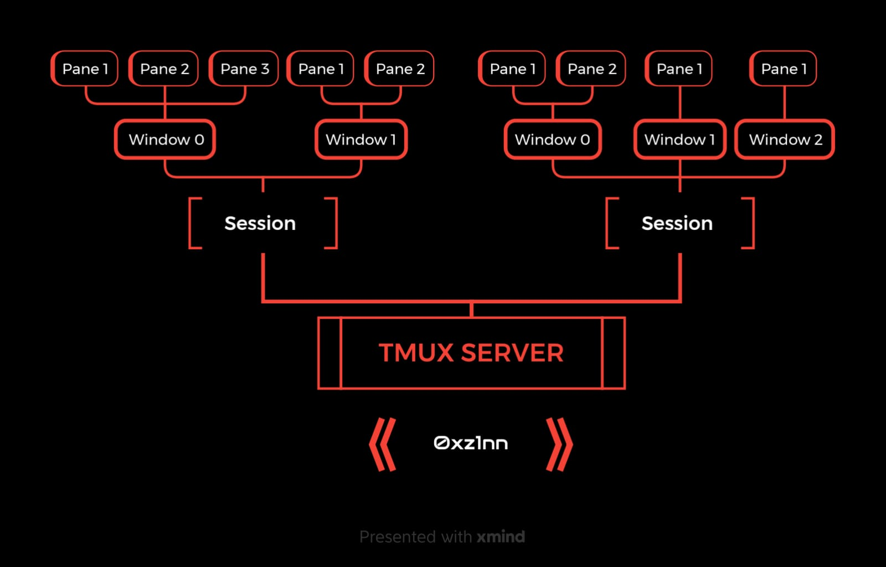
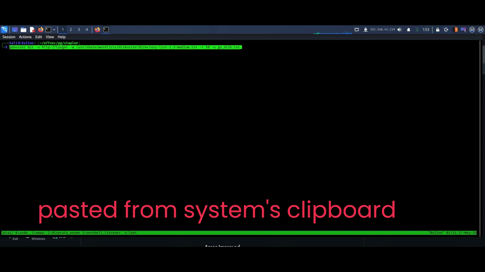

# Practical TMUX workflow for labs and offensive security environments

Once you get comfortable with TMUX, managing terminals, reverse shells, scans, and workflows becomes significantly faster and cleaner.

## TMUX (Terminal Multiplexer) is a tool that allows you to:

- Run multiple terminal sessions inside one terminal
- Split your terminal into multiple panes
- Create multiple windows (tabs)
- Keep sessions alive even if terminal closes or SSH disconnects
- Organize recon, exploitation, notes, and shells efficiently

## TMUX is heavily used in:
- Solving Labs
- Red Team Operations
- Remote SSH workflows
- CTFs

## Why TMUX is Useful for Hacking (Labs)

Instead of opening many terminals:

One terminal → Nmap
Another → Reverse shell
Another → Notes
Another → Enumeration

TMUX allows all of this inside a single organized workspace.

Example:
```
Session: Hacking
 ├── Window 0 → VPN
 ├── Window 2 → Ports and Services Scanning
 |     ├── pane 1 → nmap top 1000 ports
 |      ├── pane 2 → nmap full port scan
 |     ├── pane 3 → nmap udp port scan 
 ├── Window 3 → Directory Enumeration
 |     ├── pane 1 → fuzz directory wordlists 
 |    ├── pane 2 → fuzz files wordlists 
 ├── Window 4 → Reverse Shell Listener
 └── Window 5 → Exploit Script Setup
```

and you can create multiple sessions too.




## Debugging My Errors

Follow along. You may find this helpful.
I got few errors while setting up the tmux in my kali.

 In my setup, TMUX sessions exited immediately because of issues related to my default shell configuration (`zsh`).

the confirmation was, running `zsh -i` inside TMUX caused the session to exit immediately.
 because :
- the default shell for kali is `zsh` .
- When I wanted to create a session with tmux in kali, the default shell for tmux is also `zsh`
- `zsh` shell works fine, but when I needed to detach the tmux session or switch between sessions I lost them.

I also recommend you to use `bash` shell as default shell for tmux and also `bash` shell is stable, working super fine for me.

After this setup , you run `zsh` in your kali's default terminal and `bash` shell in your tmux terminal.

## Installing TMUX on Kali Linux


TMUX is usually pre-installed on Kali.

Check version:
 ```
tmux -V
 ```

Install if missing:
```
sudo apt update
sudo apt install tmux
```


## Setup Your Config File

follow the below instructions to configure your tmux 

The below command creates new file and opens it in your current user's root directory (Don't worry if you don't have your `.tmux.conf` file yet. Just run the command)

```
nano ~/.tmux.conf
```


paste the below commands your tmux config file (This is my current personal config file).

```
# enable vim-style selection
bind-key -T copy-mode-vi v send-keys -X begin-selection
bind-key -T copy-mode-vi y send-keys -X copy-selection-and-cancel

# default shell
set -g default-shell /bin/bash

# prefix
set -g prefix C-a
unbind C-b
bind C-a send-prefix

# mouse + vi mode
set -g mouse on
setw -g mode-keys vi


#scroll back buffer limit
set -g history-limit 100000

# split panes in current directory
bind '"' split-window -v -c "#{pane_current_path}"
bind % split-window -h -c "#{pane_current_path}"

# new window in current directory
bind c new-window -c "#{pane_current_path}"
```

NOTE : The default bind keys of TMUX is `ctrl + b`. I changed it to `ctrl + a`

This config unlocks you the two clipboard buffer potential i.e one is your system's clipboard buffer  and the other is tmux's clipboard buffer. The tmux's buffer only works inside the tmux sessions not everywhere.

Tip:
- System Clipboard:  
Use `Shift + Mouse Drag`  & `ctrl + shift + c` to copy text into your host system clipboard.

- TMUX Buffer:
Select the text by dragging the mouse to directly copy into the tmux buffer and `ctrl+a + ]` to paste from it.




Refer  [Tmux Cheatsheet | Interactive & Modern Guide](https://tmuxcheatsheet.org/) to discover more interesting and useful tmux commands.
(Edit the bind-keys to `ctrl + a`)

These tutorials helped alot to learn about TMUX. You can refer them too, to explore and learn more about the tmux
- https://youtu.be/nTqu6w2wc68?si=D7sIm7DC3IA-m6E8
- https://youtu.be/Lqehvpe_djs?si=dEl2Jbqgmmb7835g
